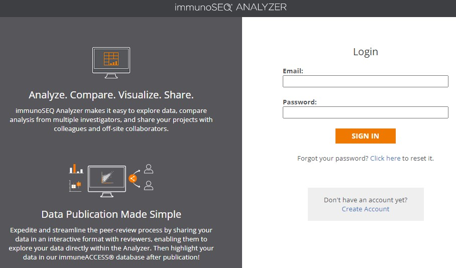
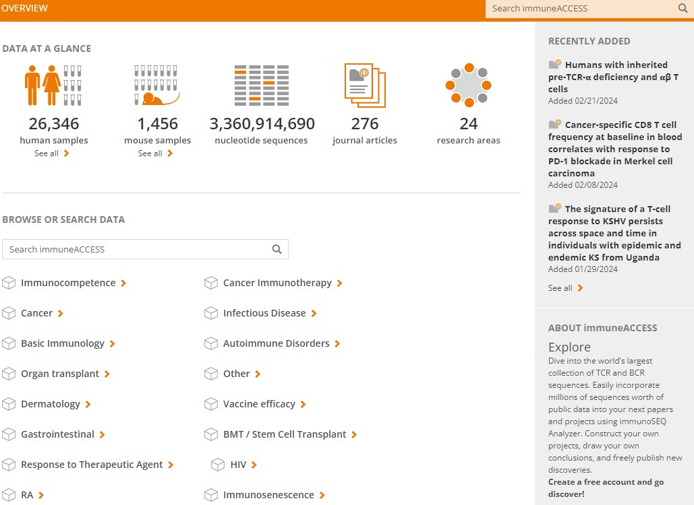
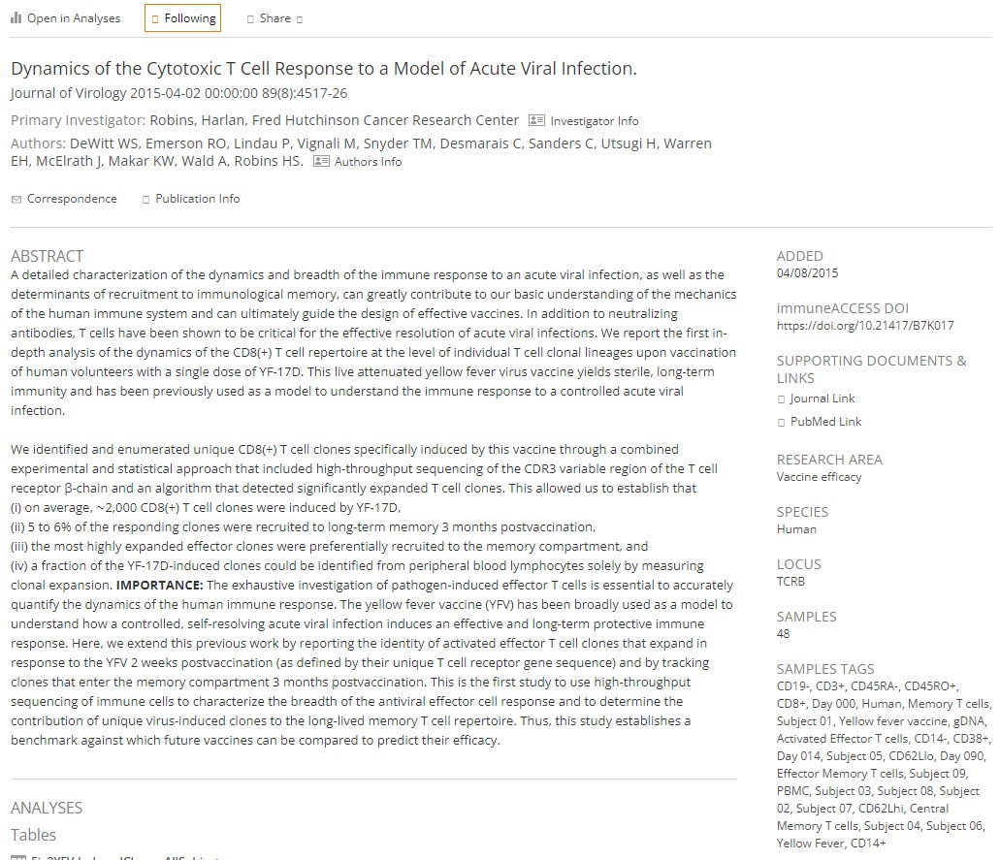
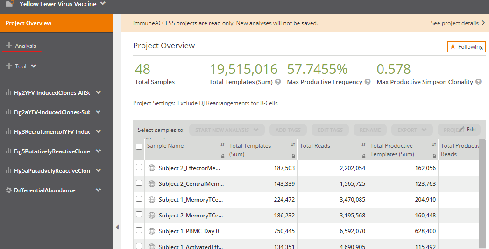
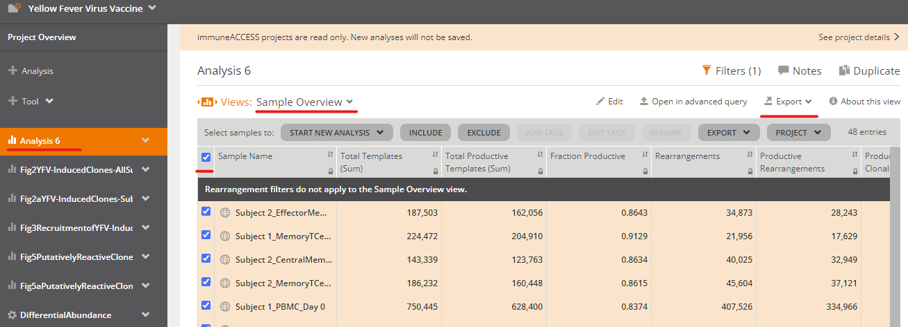
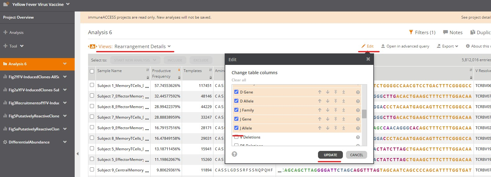

# Introduction

- This repo contains a introductory demo to antigen receptor repertoire analysis
- This demo utilizes data from [A study of the human T-cell response to yellow fever vaccination](https://pubmed.ncbi.nlm.nih.gov/25653453/)
  - A reduced version of this data is available in `/yf_data_mini`
  - The raw data was processed into the mini dataset using `scripts/make_mini_yf_data.R`
  - Instructions for downloading the raw data from ImmuneAccess are included below
- A demo of general TCR analysis using `immunarch` is found in `immunarch_demo.Rmd`
- A demo of TCR motif analysis using `GLIPH2` is found in `GLIPH_demo.Rmd`
- `renv` is used in this demo to help generate a reporducible working environment


# Setup

- Download repo to your computer

  ```      
  git clone https://github.com/BenSolomon/IMMUNO206_repertoire_demo.git
  ```

- Open `IMMUNOL206_repertoire_demo.Rproj` in Rstudio

- Install `renv` 

  ```         
  install.packages("renv")
  ```

- Install additional packages with `renv`

  ```         
  renv::restore()
  ```

### Troubleshooting

`igraph` installation can be very fussy depending on your operating system.

- Some common issues discussed here: <https://r.igraph.org/articles/installation-troubleshooting>

- `renv` contains earlier versions of `igraph/1.2.10`, `tidygraph/1.2.0` which solved some problems with allowing `R` to download all latest versions of packages and dependencies 


# Downloading data from ImmuneAccess

- Included for reference

-   **[Create ImmunoSeq account and login](https://clients.adaptivebiotech.com/login)**

    

-   **[ImmuneAccess project search](https://clients.adaptivebiotech.com/immuneaccess)**

    

-   **[Yellow Fever vaccine project on ImmuneAccess](https://clients.adaptivebiotech.com/pub/dewitt-2015-jvi)**

    

- Download sample metadata




- Download sample sequences




