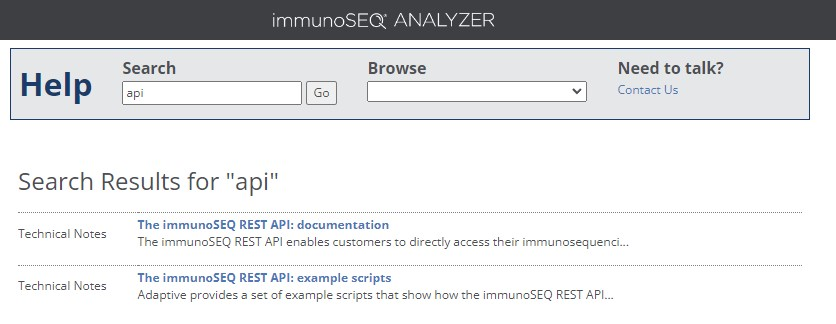

# Introduction

- This repo contains a introductory demo to antigen receptor repertoire analysis
- This demo utilizes data from [A study of the human T-cell response to yellow fever vaccination](https://pubmed.ncbi.nlm.nih.gov/25653453/)
  - A reduced version of this data is available in `data/yf_data_mini`
  - The raw data was processed into the mini dataset using `scripts/make_mini_yf_data.R`
  - Instructions for downloading the raw data from ImmuneAccess are included below
- Several analysis demos are found in the `analysis/` directory
  - A demo of general TCR analysis using `immunarch` is found in `analysis/immunarch_demo.Rmd`
    - Repertoire analysis is typically performed with custom workflows or task-specific tools, but `immunarch` does a good job of unifying general analytical approaches, at the expense of some flexibility.
  - A demo of TCR motif analysis using `GLIPH2` is found in `analysis/GLIPH_demo.Rmd`
    - GLIPH2 is one of many ways available to attempt TCR clustering and while there is no clear "best" or "most popular" approach, GLIPH2 is one of the most commonly implemented at this time. 
    - Additional data for the `GLIPH2` demo is found in `data/gliph_data`
- `renv` is used in this demo to help generate a reproducible working environment


# Setup

- Download repo to your computer

  ```      
  git clone https://github.com/BenSolomon/IMMUNO206_repertoire_demo.git
  ```

- Open `IMMUNOL206_repertoire_demo.Rproj` in Rstudio

- Install `renv` 

  ```         
  install.packages("renv")
  ```

- Install additional packages with `renv`

  ```         
  renv::restore()
  ```

### Troubleshooting

`igraph` installation can be very fussy depending on your operating system.

- Some common issues discussed here: <https://r.igraph.org/articles/installation-troubleshooting>

- `renv` lockfile contains earlier versions of `igraph/1.2.10` and `tidygraph/1.2.0`, which avoids some dependency problems created when `R` is allowed to download all latest versions of packages 

# Useful resources

### Data

- [ImmuneAccess](https://clients.adaptivebiotech.com/login) - Portal for bulk antigen-receptor sequencing data generated using Adaptive's ImmunoSeq platform. Investigators have the option of making their data publicly available.
- [VDJDB](https://vdjdb.cdr3.net/) - Database of validated TCR:antigen pairs including both bulk and single-cell data. Varying levels of validation confidence specified. Useful for antigen-related analysis, less useful for whole-repertoire level analysis

### Learning

- [Immunarch documentation](https://immunarch.com/index.html) - Contains many useful vignettes for what `immunarch` is capable of regarding repertoire analysis
- [Github repo catalogging many antigen repertoire tutorials, papers, and tools](https://github.com/crazyhottommy/TCR-BCR-seq-analysis)
- [Antibody society slack sign up](https://www.antibodysociety.org/airr-community/join-the-airr-community-slack-workspace/) - Antibody society is the main scholarly society for antigen receptor biology and maintains a slack channel to share new resources and troubleshoot analysis questions. 

# Downloading data from ImmuneAccess

### Using data viewer

-   **[Create ImmunoSeq account and login](https://clients.adaptivebiotech.com/login)**

    

-   **[ImmuneAccess project search](https://clients.adaptivebiotech.com/immuneaccess)**

    

-   **[Yellow Fever vaccine project on ImmuneAccess](https://clients.adaptivebiotech.com/pub/dewitt-2015-jvi)**
  - To open dataset, click on "Open in Analyses"

    

-   ***Download sample sequences***

    
    
- **Download sample metadata**
  - Click the "+ Analysis" button to create a new analysis window

    
    
  - Click the top "Export" button (note there are two export buttons, the lower relates to samples)
  
    
    

### ImmuneAccess API

-   Adaptive also provides an API to search and download repertoire data
-   However, it is not well publicized and not very user friendly
-   Information for the API can be found by searching for "API" in the [ImmuneAccess help search](https://clients.adaptivebiotech.com/help).

    


